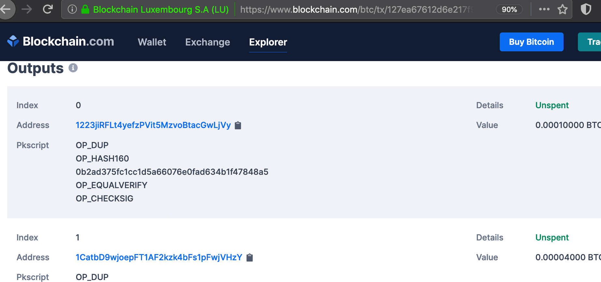
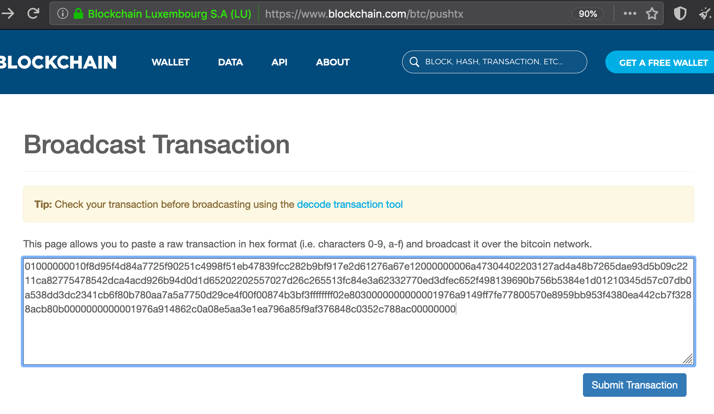
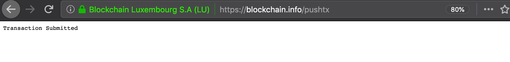

# Usage

## OFFLINE: Generating bitcoin key pairs

On the __*offline*__ computer, the script _offline/createkeys.sh_ lets you create bitcoin key pairs (bitcoin uses ECDSA) and converts them into a bunch of formats. 
Here is how we had previously created the key pair whose public bitcoin address _1223jiRFLt4yefzPVit5MzvoBtacGwLjVy_ was used as one of the outputs of transaction _127ea67612d6e217f99b2b28cc9f8347eb518f99c45102f925774ad8f4958d0f_: 
Note: _Never disclose any representation of your private key online as we do here - the reason we do it here is because the private key is worthless by now: All transaction outputs are *spent*_. 

    ~/bitcoin$  offline/entropy.sh | offline/createkeys.sh 
    Enter your 32-byte secret as a hex string and press ctrl-d when you're done (ignore this message if you've piped the byte string through STDIN)
    Private key: ---------------------------------------
    0541B96413B3AA31039DA28FADF5933843FEC01B3417C4F3CBB9D5728A52BCF8
    Private WIF: ---------------------------------------
    KwPvrNmsD6o39hY9VSWipdhn4koi7oqGiomJErjkjvKrqudZNcd7
    Private key: ---------------------------------------
    0541b96413b3aa31039da28fadf5933843fec01b3417c4f3cbb9d5728a52bcf8
    Private key in DER format: -------------------------
    302e02010104200541b96413b3aa31039da28fadf5933843fec01b3417c4f3cbb9d5728a52bcf8a00706052b8104000a
    Public key in DER format: --------------------------
    3056301006072a8648ce3d020106052b8104000a0342000445d57c07db0a538dd3dc2341cb6f80b780aa7a5a7750d29ce4f00f00874b3bf368f8a17790f70638a43e666fe514614fc6d729801f79c3ed8f2932812e7305a9
    Public key: ----------------------------------------
    0445d57c07db0a538dd3dc2341cb6f80b780aa7a5a7750d29ce4f00f00874b3bf368f8a17790f70638a43e666fe514614fc6d729801f79c3ed8f2932812e7305a9
    Public Key (compressed): --------------------------
    0345d57c07db0a538dd3dc2341cb6f80b780aa7a5a7750d29ce4f00f00874b3bf3
    pubkeyhash: ----------------------------------------
    0b2ad375fc1cc1d5a66076e0fad634b1f47848a5
    BTC Address: ---------------------------------------
    1223jiRFLt4yefzPVit5MzvoBtacGwLjVy 

The _entropy_ piped into the key generation script gets 256 bits of random data from /dev/random, which gets the data from the entropy pool of the Linux kernel. 
There are two key formats that stand out in terms of usefullness: the private WIF (wallet input format) and the public BTC address, starting with the letter 1 (for P2PKH addresses). 
 
With our next transaction in mind, we created 2 new key pairs using the very same approach: 

    ~/bitcoin$  offline/entropy.sh | offline/createkeys.sh 
    Enter your 32-byte secret as a hex string and press ctrl-d when you're done (ignore this message if you've piped the byte string through STDIN)
    Private key: ---------------------------------------
    _(truncated here)_
    pubkeyhash: ----------------------------------------
    9ff7fe77800570e8959bb953f4380ea442cb7f32
    BTC Address: ---------------------------------------
    1FaqXRmQiYyGizWS9fK3GN6Y9GeSxPyRt1

    ~/bitcoin$  offline/entropy.sh | offline/createkeys.sh 
    Enter your 32-byte secret as a hex string and press ctrl-d when you're done (ignore this message if you've piped the byte string through STDIN)
    Private key: ---------------------------------------
    _(truncated here)_
    pubkeyhash: ----------------------------------------
    862c0a08e5aa3e1ea796a85f9af376848c0352c7
    BTC Address: ---------------------------------------
    1DESJbwXNkqbFWuTnygNnGWtzz85KNSfKm

Note: It is crucial to to store the private keys on the offline computer (and/or to write them down on a paper wallet), because you will need them in the future when you want to redeem unspent bitcoins from the associated addresses. 
__*It is your responsibility to keep the private keys safe, your assets will be lost in case of key loss or leak*__ 

## ONLINE: Preparing the transaction

On the __*online*__ computer, we decided to spend the output associated with address _1223jiRFLt4yefzPVit5MzvoBtacGwLjVy_  in a _new_ transaction, so we opened TOR browser to display the details of the previous transaction: 
 

 
 
With the output information and the bitcoin addresses that we generated earlier, we were prepared to run script _ONLINE/sign.sh_, passing the structural template _tx/template.xml_ as a parameter. 
Please note the interactive "_Enter xyz..._" questions that the script poses, and the answers that we've given: 

    ~/bitcoin$  ONLINE/sign.sh tx/template.xml 
    Enter the transaction ID (txid) of the outpoint that you want to spend from: 127ea67612d6e217f99b2b28cc9f8347eb518f99c45102f925774ad8f4958d0f
    previoustxid: 127ea67612d6e217f99b2b28cc9f8347eb518f99c45102f925774ad8f4958d0f
    In order to provide the following data, open you favourite block explorer (e.g. https://www.blockchain.com/btc/tx/127ea67612d6e217f99b2b28cc9f8347eb518f99c45102f925774ad8f4958d0f) in your (tor) browser.
    Enter the (decimal) output INDEX of the outpoint that you want to spend from: 0
    outpoint index: 00000000
    Enter the bitcoin address (P2PKH format, starts with the letter '1') of the outpoint that you want to spend from: 1223jiRFLt4yefzPVit5MzvoBtacGwLjVy
    outpoint address: 1223jiRFLt4yefzPVit5MzvoBtacGwLjVy
    outpoint pubkeyhash: 0b2ad375fc1cc1d5a66076e0fad634b1f47848a5
    Enter the decimal value (in satoshis) of unspent transaction output (UTXO) of that outpoint: 10000
    outpoint utxo: 10000
    Enter the bitcoin address (P2PKH format, starts with the letter '1') of the recipient that you want to send to: 1FaqXRmQiYyGizWS9fK3GN6Y9GeSxPyRt1
    [1] recipient address: 1FaqXRmQiYyGizWS9fK3GN6Y9GeSxPyRt1
    Enter the decimal amount of satoshis that the recipient should receive: 1000
    [1] satoshis: 1000
    0) finish!
    1) add a recipient
    #? 1
    Enter the bitcoin address (P2PKH format, starts with the letter '1') of the recipient that you want to send to: 1DESJbwXNkqbFWuTnygNnGWtzz85KNSfKm
    [2] recipient address: 1DESJbwXNkqbFWuTnygNnGWtzz85KNSfKm
    Enter the decimal amount of satoshis that the recipient should receive: 3000
    [2] satoshis: 3000
    0) finish!
    1) add a recipient
    #? 0
    numberofoutputs: 02
    next address: 1FaqXRmQiYyGizWS9fK3GN6Y9GeSxPyRt1
    nextpubkeyhash: 9ff7fe77800570e8959bb953f4380ea442cb7f32
    satoshis: 1000 (e803000000000000)
    next address: 1DESJbwXNkqbFWuTnygNnGWtzz85KNSfKm
    nextpubkeyhash: 862c0a08e5aa3e1ea796a85f9af376848c0352c7
    satoshis: 3000 (b80b000000000000)
    totalsatoshis: 4000 (decimal)
    fee: 6000
    rawtransaction: 01000000010f8d95f4d84a7725f90251c4998f51eb47839fcc282b9bf917e2d61276a67e12000000001976a9140b2ad375fc1cc1d5a66076e0fad634b1f47848a588acffffffff02e8030000000000001976a9149ff7fe77800570e8959bb953f4380ea442cb7f3288acb80b0000000000001976a914862c0a08e5aa3e1ea796a85f9af376848c0352c788ac0000000001000000
    rawtransactionhash: cafe160a6034873ef8390ec5a334916fd8ecd53913807420515478c99d82010a
    <txs type="P2PKH">
      <tx type="previous">
        <txid>127ea67612d6e217f99b2b28cc9f8347eb518f99c45102f925774ad8f4958d0f</txid>
        <outputs>
          <output index="00000000">
            <address>1223jiRFLt4yefzPVit5MzvoBtacGwLjVy</address>
            <value desc="decimal value in satoshis">10000</value>
            <pkscript>
              <raw bits="8" desc="OP_DUP">76</raw>
              <raw bits="8" desc="OP_HASH160">a9</raw>
              <raw bits="8" desc="push 0x14 bytes">14</raw>
              <raw bits="160" desc="(pubkeyhash)">0b2ad375fc1cc1d5a66076e0fad634b1f47848a5</raw>
              <raw bits="8" desc="OP_EQUALVERIFY">88</raw>
              <raw bits="8" desc="OP_CHECKSIG">ac</raw>
            </pkscript>
          </output>
        </outputs>
      </tx>
      <tx type="current">
        <inputs>
          <input>
            <raw bits="32" desc="1. version">01000000</raw>
            <raw bits="8" desc="2. varint specifying the number of inputs">01</raw>
            <raw bits="256" desc="3. transaction from which we want to redeem an output (reverse order)">0f8d95f4d84a7725f90251c4998f51eb47839fcc282b9bf917e2d61276a67e12</raw>
            <raw bits="32" desc="4. output index we want to redeem from the transaction">00000000</raw>
            <scriptsig iteration="1">
              <raw bits="8" desc="5. For the purpose of signing the transaction, this is temporarily filled with the scriptPubKey of the output we want to redeem. First we write a one-byte varint (in hex) which denotes the length of the scriptPubKey">19</raw>
              <raw bits="8" desc="6. (OP_DUP)">76</raw>
              <raw bits="8" desc="6. (OP_HASH160 - do a RipeMD160 on the top stack item)">a9</raw>
              <raw bits="8" desc="6. (push hex 0x14 bytes on stack)">14</raw>
              <raw bits="160" desc="6. (Then we write the actual pubkeyhash)">0b2ad375fc1cc1d5a66076e0fad634b1f47848a5</raw>
              <raw bits="8" desc="6. (OP_EQUALVERIFY)">88</raw>
              <raw bits="8" desc="6. (OP_CHECKSIG)">ac</raw>
            </scriptsig>
            <scriptsig iteration="2" desc="14. double-SHA256 hash this entire structure (from iteration 1). This will be the input to the signing.">
              <raw bits="8" desc="17. replace the one-byte, varint length-field from step 5 with the length of the data from step 16."/>
              <hex>
                <raw bits="8" desc="16. OPCODE containing the length of the DER-encoded signature plus the one-byte hash code type"/>
                <raw bits="?" desc="15. create ECDSA signature"/>
                <raw bits="8" desc="16. hash code type (SIGHASH_ALL)">01</raw>
                <raw bits="8" desc="16. OPCODE containing the length of the public key of signer"/>
                <raw bits="264-520" desc="16. public key of signer"/>
              </hex>
            </scriptsig>
            <raw bits="32" desc="7. sequence. This is currently always set to 0xffffffff">ffffffff</raw>
          </input>
        </inputs>
        <outputs>
          <raw bits="8" desc="8. varint containing the number of outputs in our new transaction">02</raw>
          <output>
            <address>1FaqXRmQiYyGizWS9fK3GN6Y9GeSxPyRt1</address>
            <value desc="decimal value in satoshis">1000</value>
            <raw bits="64" desc="9. (64 bit integer, little-endian) containing the amount we want to redeem from the specified output for this recipient address">e803000000000000</raw>
            <raw bits="8" desc="10. length of the output script (0x19)">19</raw>
            <raw bits="8" desc="11. (OP_DUP)">76</raw>
            <raw bits="8" desc="11. (OP_HASH160)">a9</raw>
            <raw bits="8" desc="11. (push hex 0x14 bytes on stack)">14</raw>
            <raw bits="160" desc="11. Then we write the pubkeyhash of the recipient">9ff7fe77800570e8959bb953f4380ea442cb7f32</raw>
            <raw bits="8" desc="11. (OP_EQUALVERIFY)">88</raw>
            <raw bits="8" desc="11. (OP_CHECKSIG)">ac</raw>
          </output>
          <output>
            <address>1DESJbwXNkqbFWuTnygNnGWtzz85KNSfKm</address>
            <value desc="decimal value in satoshis">3000</value>
            <raw bits="64" desc="9. (64 bit integer, little-endian) containing the amount we want to redeem from the specified output for this recipient address">b80b000000000000</raw>
            <raw bits="8" desc="10. length of the output script (0x19)">19</raw>
            <raw bits="8" desc="11. (OP_DUP)">76</raw>
            <raw bits="8" desc="11. (OP_HASH160)">a9</raw>
            <raw bits="8" desc="11. (push hex 0x14 bytes on stack)">14</raw>
            <raw bits="160" desc="11. Then we write the pubkeyhash of the recipient">862c0a08e5aa3e1ea796a85f9af376848c0352c7</raw>
            <raw bits="8" desc="11. (OP_EQUALVERIFY)">88</raw>
            <raw bits="8" desc="11. (OP_CHECKSIG)">ac</raw>
          </output>
          <raw bits="32" desc="12. lock time">00000000</raw>
          <raw iteration="1" bits="32" desc="13. Iteration 1: hash code type / Iteration 2: We finish off by removing the four-byte hash code type we added in step 13">01000000</raw>
        </outputs>
      </tx>
    </txs>
    Above you see the content of xml file: /tmp/tmp.EUK5kzW5Ep
    Copy that xml file to your OFFLINE computer (the computer where your private keys are securely stored) for transaction signing with offline/sign.sh

The output of the script was a new xml file, containing the filled-out template with all the entered information in the right place. There was no signature yet in this data, it was just the preparation for the signing that we were supposed to do on the _offline_ computer as a next step. 
Note: Do the _math_: We had 10000 satoshis to spend, and intended to give 1000 to address 1FaqXRmQiYyGizWS9fK3GN6Y9GeSxPyRt1 and 3000 to address 1DESJbwXNkqbFWuTnygNnGWtzz85KNSfKm. Which implies that the _rest_ went to the blockchain miners as a fee. A fee of 6000 satoshis for a transaction of this kind was quite normal by the time of this writing, as fees are calculated on the basis of bytes transmitted, not amount spent. The only reason that, in the transaction we speak about in this article, the fee was unproportionally high compared to the amounts spent was the fact that the spent amounts were _very low_. Miner fees can be quite volatile - if you want to get a feeling for the current miner fees when you create your next transaction, have a look at the '_mempool_', e.g. (https://jochen-hoenicke.de/queue/ ) 

## OFFLINE: Signing the transaction

By means of USB drive or similar, we transfered the xml file created on the online computer to our __*offline*__ computer. 
Now it was time to _prove ownership_ of address _1223jiRFLt4yefzPVit5MzvoBtacGwLjVy_, which is generally done by signing the raw transaction structure with the corresponding private key. 
The private key information was stored on the __*offline*__ computer, giving us the opportunity to pipe the private key WIF into our script _offline/sign.sh_, passing the xml file as an argument. 
See how the script did its thing: 

    ~/bitcoin$  <<<KwPvrNmsD6o39hY9VSWipdhn4koi7oqGiomJErjkjvKrqudZNcd7 offline/sign.sh /tmp/tmp.EUK5kzW5Ep
    Press ctrl-d when you are done entering the private key in wallet input format (ignore this message if you have piped the private key through STDIN)
    previoustxid: 127ea67612d6e217f99b2b28cc9f8347eb518f99c45102f925774ad8f4958d0f
    outpoint pubkeyhash: 0b2ad375fc1cc1d5a66076e0fad634b1f47848a5
    nextpubkeyhash: 9ff7fe77800570e8959bb953f4380ea442cb7f32
    satoshis: 1000 (e803000000000000)
    nextpubkeyhash: 862c0a08e5aa3e1ea796a85f9af376848c0352c7
    satoshis: 3000 (b80b000000000000)
    totalsatoshis: 4000 (decimal)
    fee: 6000
    rawtransaction: 01000000010f8d95f4d84a7725f90251c4998f51eb47839fcc282b9bf917e2d61276a67e12000000001976a9140b2ad375fc1cc1d5a66076e0fad634b1f47848a588acffffffff02e8030000000000001976a9149ff7fe77800570e8959bb953f4380ea442cb7f3288acb80b0000000000001976a914862c0a08e5aa3e1ea796a85f9af376848c0352c788ac0000000001000000
    rawtransactionhash: cafe160a6034873ef8390ec5a334916fd8ecd53913807420515478c99d82010a
    signedrawtransaction: 304402203127ad4a48b7265dae93d5b09c2211ca82775478542dca4acd926b94d0d1d65202202557027d26c265513fc84e3a62332770ed3dfec652f498139690b756b5384e1d
    verifytransaction: Signature Verified Successfully
    publickey: 0345d57c07db0a538dd3dc2341cb6f80b780aa7a5a7750d29ce4f00f00874b3bf3
    scriptsig: 47304402203127ad4a48b7265dae93d5b09c2211ca82775478542dca4acd926b94d0d1d65202202557027d26c265513fc84e3a62332770ed3dfec652f498139690b756b5384e1d01210345d57c07db0a538dd3dc2341cb6f80b780aa7a5a7750d29ce4f00f00874b3bf3
    <txs type="P2PKH">
      <tx type="previous">
        <txid>127ea67612d6e217f99b2b28cc9f8347eb518f99c45102f925774ad8f4958d0f</txid>
        <outputs>
          <output index="00000000">
            <address>1223jiRFLt4yefzPVit5MzvoBtacGwLjVy</address>
            <value desc="decimal value in satoshis">10000</value>
            <pkscript>
              <raw bits="8" desc="OP_DUP">76</raw>
              <raw bits="8" desc="OP_HASH160">a9</raw>
              <raw bits="8" desc="push 0x14 bytes">14</raw>
              <raw bits="160" desc="(pubkeyhash)">0b2ad375fc1cc1d5a66076e0fad634b1f47848a5</raw>
              <raw bits="8" desc="OP_EQUALVERIFY">88</raw>
              <raw bits="8" desc="OP_CHECKSIG">ac</raw>
            </pkscript>
          </output>
        </outputs>
      </tx>
      <tx type="current">
        <inputs>
          <input>
            <raw bits="32" desc="1. version">01000000</raw>
            <raw bits="8" desc="2. varint specifying the number of inputs">01</raw>
            <raw bits="256" desc="3. transaction from which we want to redeem an output (reverse order)">0f8d95f4d84a7725f90251c4998f51eb47839fcc282b9bf917e2d61276a67e12</raw>
            <raw bits="32" desc="4. output index we want to redeem from the transaction">00000000</raw>
            <scriptsig iteration="1">
              <raw bits="8" desc="5. For the purpose of signing the transaction, this is temporarily filled with the scriptPubKey of the output we want to redeem. First we write a one-byte varint (in hex) which denotes the length of the scriptPubKey">19</raw>
              <raw bits="8" desc="6. (OP_DUP)">76</raw>
              <raw bits="8" desc="6. (OP_HASH160 - do a RipeMD160 on the top stack item)">a9</raw>
              <raw bits="8" desc="6. (push hex 0x14 bytes on stack)">14</raw>
              <raw bits="160" desc="6. (Then we write the actual pubkeyhash)">0b2ad375fc1cc1d5a66076e0fad634b1f47848a5</raw>
              <raw bits="8" desc="6. (OP_EQUALVERIFY)">88</raw>
              <raw bits="8" desc="6. (OP_CHECKSIG)">ac</raw>
            </scriptsig>
            <scriptsig iteration="2" desc="14. double-SHA256 hash this entire structure (from iteration 1). This will be the input to the signing.">
              <raw bits="8" desc="17. replace the one-byte, varint length-field from step 5 with the length of the data from step 16.">6a</raw>
              <hex>
                <raw bits="8" desc="16. OPCODE containing the length of the DER-encoded signature plus the one-byte hash code type">47</raw>
                <raw bits="?" desc="15. create ECDSA signature">304402203127ad4a48b7265dae93d5b09c2211ca82775478542dca4acd926b94d0d1d65202202557027d26c265513fc84e3a62332770ed3dfec652f498139690b756b5384e1d</raw>
                <raw bits="8" desc="16. hash code type (SIGHASH_ALL)">01</raw>
                <raw bits="8" desc="16. OPCODE containing the length of the public key of signer">21</raw>
                <raw bits="264-520" desc="16. public key of signer">0345d57c07db0a538dd3dc2341cb6f80b780aa7a5a7750d29ce4f00f00874b3bf3</raw>
              </hex>
            </scriptsig>
            <raw bits="32" desc="7. sequence. This is currently always set to 0xffffffff">ffffffff</raw>
          </input>
        </inputs>
        <outputs>
          <raw bits="8" desc="8. varint containing the number of outputs in our new transaction">02</raw>
          <output>
            <address>1FaqXRmQiYyGizWS9fK3GN6Y9GeSxPyRt1</address>
            <value desc="decimal value in satoshis">1000</value>
            <raw bits="64" desc="9. (64 bit integer, little-endian) containing the amount we want to redeem from the specified output for this recipient address">e803000000000000</raw>
            <raw bits="8" desc="10. length of the output script (0x19)">19</raw>
            <raw bits="8" desc="11. (OP_DUP)">76</raw>
            <raw bits="8" desc="11. (OP_HASH160)">a9</raw>
            <raw bits="8" desc="11. (push hex 0x14 bytes on stack)">14</raw>
            <raw bits="160" desc="11. Then we write the pubkeyhash of the recipient">9ff7fe77800570e8959bb953f4380ea442cb7f32</raw>
            <raw bits="8" desc="11. (OP_EQUALVERIFY)">88</raw>
            <raw bits="8" desc="11. (OP_CHECKSIG)">ac</raw>
          </output>
          <output>
            <address>1DESJbwXNkqbFWuTnygNnGWtzz85KNSfKm</address>
            <value desc="decimal value in satoshis">3000</value>
            <raw bits="64" desc="9. (64 bit integer, little-endian) containing the amount we want to redeem from the specified output for this recipient address">b80b000000000000</raw>
            <raw bits="8" desc="10. length of the output script (0x19)">19</raw>
            <raw bits="8" desc="11. (OP_DUP)">76</raw>
            <raw bits="8" desc="11. (OP_HASH160)">a9</raw>
            <raw bits="8" desc="11. (push hex 0x14 bytes on stack)">14</raw>
            <raw bits="160" desc="11. Then we write the pubkeyhash of the recipient">862c0a08e5aa3e1ea796a85f9af376848c0352c7</raw>
            <raw bits="8" desc="11. (OP_EQUALVERIFY)">88</raw>
            <raw bits="8" desc="11. (OP_CHECKSIG)">ac</raw>
          </output>
          <raw bits="32" desc="12. lock time">00000000</raw>
          <raw iteration="1" bits="32" desc="13. Iteration 1: hash code type / Iteration 2: We finish off by removing the four-byte hash code type we added in step 13">01000000</raw>
        </outputs>
      </tx>
    </txs>
    txid: 180d08561d4f85e22bfcde890a17f353250c302e995042a1e42b226984e3e9da
    signedtransaction: 01000000010f8d95f4d84a7725f90251c4998f51eb47839fcc282b9bf917e2d61276a67e12000000006a47304402203127ad4a48b7265dae93d5b09c2211ca82775478542dca4acd926b94d0d1d65202202557027d26c265513fc84e3a62332770ed3dfec652f498139690b756b5384e1d01210345d57c07db0a538dd3dc2341cb6f80b780aa7a5a7750d29ce4f00f00874b3bf3ffffffff02e8030000000000001976a9149ff7fe77800570e8959bb953f4380ea442cb7f3288acb80b0000000000001976a914862c0a08e5aa3e1ea796a85f9af376848c0352c788ac00000000                                                                                                                                                                                         
    For verification, paste your signedtransaction into https://blockchain.com/btc/decode-tx and check if everything looks as you planned.
    After verification, paste your signedtransaction into https://blockchain.com/btc/pushtx to broadcast it.
    Once you have successfully broadcast your tansaction, watch its status on the blockchain: https://blockchain.com/btc/tx/180d08561d4f85e22bfcde890a17f353250c302e995042a1e42b226984e3e9da.

## ONLINE: Verifying and broadcasting the transaction

As shown already in the [README](README.md) file, we copied the '_signedtransaction_' string over to our __*online*__ computer, and double checked our transaction details with the help of (https://blockchain.com/btc/decode-tx): 
 

    {
      "version": 1,
      "locktime": 0,
      "ins": [
        {
          "n": 0,
          "script": {
            "asm": "304402203127ad4a48b7265dae93d5b09c2211ca82775478542dca4acd926b94d0d1d65202202557027d26c265513fc84e3a62332770ed3dfec652f498139690b756b5384e1d01 0345d57c07db0a538dd3dc2341cb6f80b780aa7a5a7750d29ce4f00f00874b3bf3",
            "hex": "47304402203127ad4a48b7265dae93d5b09c2211ca82775478542dca4acd926b94d0d1d65202202557027d26c265513fc84e3a62332770ed3dfec652f498139690b756b5384e1d01210345d57c07db0a538dd3dc2341cb6f80b780aa7a5a7750d29ce4f00f00874b3bf3"
          },
          "sequence": 4294967295,
          "txid": "127ea67612d6e217f99b2b28cc9f8347eb518f99c45102f925774ad8f4958d0f",
          "witness": []
        }
      ],
      "outs": [
        {
          "script": {
            "addresses": [
              "1FaqXRmQiYyGizWS9fK3GN6Y9GeSxPyRt1"
            ],
            "asm": "OP_DUP OP_HASH160 9ff7fe77800570e8959bb953f4380ea442cb7f32 OP_EQUALVERIFY OP_CHECKSIG",
            "hex": "76a9149ff7fe77800570e8959bb953f4380ea442cb7f3288ac"
          },
          "value": 1000
        },
        {
          "script": {
            "addresses": [
              "1DESJbwXNkqbFWuTnygNnGWtzz85KNSfKm"
            ],
            "asm": "OP_DUP OP_HASH160 862c0a08e5aa3e1ea796a85f9af376848c0352c7 OP_EQUALVERIFY OP_CHECKSIG",
            "hex": "76a914862c0a08e5aa3e1ea796a85f9af376848c0352c788ac"
          },
          "value": 3000
        }
      ],
      "hash": "180d08561d4f85e22bfcde890a17f353250c302e995042a1e42b226984e3e9da",
      "txid": "180d08561d4f85e22bfcde890a17f353250c302e995042a1e42b226984e3e9da"
    }

After verification, we were ready to broadcast the transaction into the blockchain by using (https://blockchain.com/btc/pushtx): 

...which was successful, the signature was accepted and the transaction was broadcast to the blockchain miners: 

Feel free to check the confirmed status of [that transaction](https://blockchain.com/btc/tx/180d08561d4f85e22bfcde890a17f353250c302e995042a1e42b226984e3e9da) in the blockchain.

 
